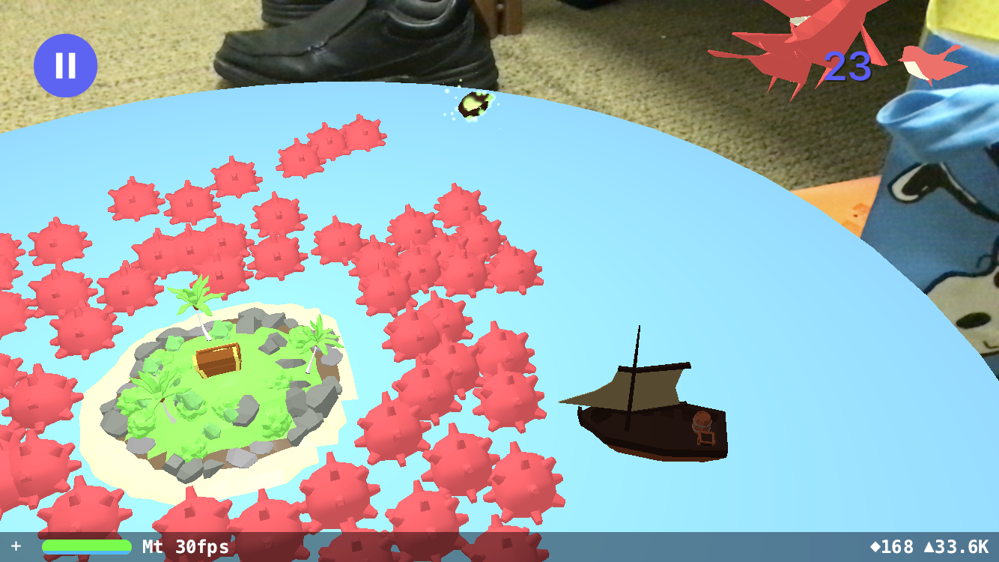

# Gun Ho

## About

Gun Ho is an Augmented Reality (AR) game for iOS. The goal of the game is to defend your treasure for as long as possible before invaders inevitably take the loot as their plunder. You can defend against these invaders by tapping on their ships or by using whales or watermines to hinder their progress.

The application is not yet available on the App Store.

## Supported Devices

The following devices can run this application:

* iPhone 6s / 6s Plus
* iPhone 7 / 7 Plus
* iPhone SE
* iPhone 8 / 8 Plus
* iPhone X
* iPad Pro (10.5-inch, 12.9-inch, and the 9.7-inch models)
* iPad (2017)

We are not able to extend this list to older devices since this application requires ARKit to run.

## Bug Reports

Please try to be as specific as possible when describing the error. Some helpful information includes:

* What is the bug?
* What you were doing when the bug occurred?
* What state was the application in?
* Did this happen on the first run of the application?
* How often can you reproduce this bug?

### If you have a GitHub Account:
Please create an issue in this repository and I'll look at it as soon as possible.

### If you don't have a GitHub Account:
Feel free to email `chris@chrisperkins.me` with any bug report information as well.

## Dev Corner

### Building the Application

To build this application:

1. Clone this repository
1. Run `pod install`
1. Open the `.xcworkspace` file
1. Update the code-signing certificate
1. Run the project on a physical device

NOTE: While testing this application on a Simulator is possible, it is not recommended.

## Credits

App Icon: Bryce Bridgeman  
3D Models: [Quaternius](http://quaternius.com/?i=1)  
Everything Else: [Chris Perkins](http://ChrisPerkins.me)  
